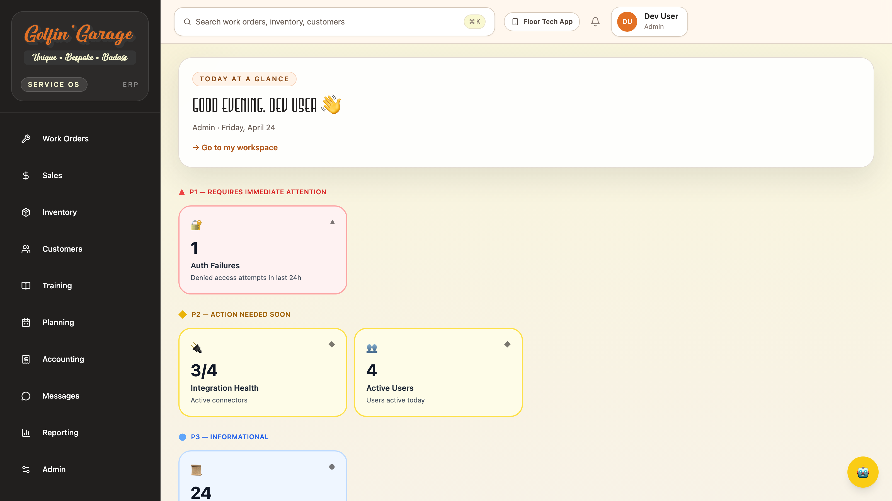

# ERP Operator Manual

For shop managers, sales, parts, accounting, admin, and trainers at Golfin Garage.

Live site: <https://golfingarage.m4nos.com>

---

## If you only read one thing

Sign in with your `@golfingarage.com` Google account. The sidebar on the left groups everything by job function (Work Orders, Sales, Inventory, Customers, Training, Planning, Accounting, Messages, Reporting, Admin). Click the Copilot 🤖 in the bottom-right corner whenever you want a shortcut — it can find customers, look up inventory, pull work orders, and summarize your day.

---

## Before you start

**URL**: <https://golfingarage.m4nos.com> — bookmark it.

**Sign-in**:

1. Enter your email, click **Continue**.
2. If your email is `@golfingarage.com`, you're redirected to Google. Sign in once and you're back in the ERP. No password to remember.
3. If you're a service account (e.g. `krand40@gmail.com`), you stay on the ERP and type your password.

**First-time users**: you may be asked to set a new password. The requirements show live as you type (12+ characters, mix of upper/lower/number/special).

If Google rejects you with "This account can't be used to sign in", you're on a personal Gmail instead of your Workspace account — use the Google account picker to switch.

---

## At a glance

**Sidebar (left)**: always-visible navigation. Click a section to expand it; sub-items show under the parent. Your current page is highlighted in orange.

**Header (top)**:

- **⌘K search** — quick-find across work orders, inventory, and customers.
- **Offline queue indicator** — `↑ N pending` appears when a mutation (e.g. clicking "Retry sync") failed due to a network hiccup and is being retried. Click **Replay** to force it.
- **Floor Tech App** link — launches the mobile tech app in a new tab.
- **Notifications** 🔔 — unread count badge; click to see channel mentions, task assignments, sync failures.
- **User menu** — your name, role, Sign out.

**Main area**: the page you navigated to.

**Copilot** 🤖 (bottom-right): press anywhere to ask questions about your data. It can answer things like "show me all open work orders for Pier Motorsports" or "which parts are below reorder point?"

**Session timeout**: you're auto-refreshed every 5 minutes. If your session actually expires, you're bounced back to the sign-in page — nothing is lost, just sign in again.

---

## Your role, your pages

The ERP has 8 roles (Cognito groups). Everyone sees every sidebar section; each role has **its own primary pages** that do their job.

| Role | Primary pages |
|---|---|
| `admin` | Everything. In particular: **Admin → User Access, Audit Trail, Integrations**. |
| `shop_manager` | **Work Orders → Dispatch Board**, **Open / Blocked**, **Planning → Build Slots**, **Reporting**. |
| `technician` | **Work Orders → My Queue**, **Training → My OJT**. (Most technicians live in the Floor Tech app, not here.) |
| `parts_manager` | **Inventory → Part Lookup, Reservations, Receiving, Manufacturers**. |
| `sales` | **Sales → Pipeline, Quotes, Forecast**. **Customers**. |
| `accounting` | **Accounting → Sync Monitor, Reconciliation**. **Admin → Audit Trail**. |
| `trainer_ojt_lead` | **Training → SOP Library, Assignments, Admin**. |
| `read_only_executive` | **Reporting**, and read-only views of everything else. |

Roles are assigned by an admin under **Admin → User Access**. A user can hold multiple roles.

---

## Work Orders

The heart of the shop. A **Work Order (WO)** is one golf-cart build or service job. Each WO has a vehicle, a customer, a status, and a list of **technician tasks** — the actual work to be done.

### Create a work order

`/work-orders/new`

Fill in: customer, vehicle (new or existing), build configuration (which BOM), priority, notes. **Save** creates the WO in `PLANNED` status with tasks generated from the build config.

### Dispatch Board

`/work-orders/dispatch` — **[shop_manager]**

The kanban-style board for assigning tasks to technicians. Columns are people. Unassigned tasks appear at the top. Drag a task card onto a technician's column to assign; drop it back in "Unassigned" to unassign.

Use this every morning to lay out the day's work.

### Open / Blocked

`/work-orders/open` — **[shop_manager]**

All WOs that aren't `COMPLETED` or `CANCELLED`. Use the status filter to zoom in on `BLOCKED` — those are waiting on parts, approvals, or a second opinion. Each row shows:

- WO number, title, status, age, blocking reason, reporter.
- **Unblock** button — clears the block and sends the task back to READY.
- **Escalate** — posts to the relevant channel in Messages.

### My Queue

`/work-orders/my-queue` — **[technician]** (mostly used from the Floor Tech App)

Your assigned tasks, newest first. Tap **Start** to transition `READY → IN_PROGRESS`; when done, tap **Complete**. If something stops you, tap **Block**, pick a reason code, and add detail.

### SOP Runner, Time Logging, QC Checklists

`/work-orders/sop-runner`, `/work-orders/time-logging`, `/work-orders/qc-checklists`

Specialized screens used during task execution — step-by-step work instructions, clock-in/clock-out, and final-quality gates. Most of this is done from the Floor Tech App in practice; see **[floor-tech-manual.md](./floor-tech-manual.md)**.

---

## Sales

`/sales` — **[sales]**

Dashboard lands on KPIs: total opportunities, weighted forecast, win rate, average deal size.

### Pipeline

`/sales/pipeline` — kanban of deals by stage (`PROSPECTING`, `PROPOSAL`, `NEGOTIATION`, `CLOSED_WON`, `CLOSED_LOST`). Drag a deal across stages. Click a card for full detail + activity log.

### Opportunities

`/sales/opportunities` — list view of every deal. Filter by stage, owner, close date.

### Quotes

`/sales/quotes` — all quotes across customers. Status: `DRAFT`, `SENT`, `ACCEPTED`, `REJECTED`. Creating a new quote: **New Quote** button → pick customer, line items, valid-through date, send.

### Forecast

`/sales/forecast` — weighted and best-case revenue projections for the current and next quarter.

### Activity Log

Under Sales → Activity. Every call, email, meeting, or note logged against an opportunity. Use this to keep a customer's history complete.

---

## Inventory

`/inventory` — **[parts_manager]**

Golfin Garage uses a three-tier part lifecycle:

- **Raw Component** — a part as delivered (e.g. raw steel tube, a motor)
- **Prepared Component** — after fabrication (cut, bent, welded)
- **Assembled Component** — after install into a larger subassembly

Each tier is a separate Part row, linked through a `producedFromPartId` chain. A single "4-Link Suspension Bent" rolls up as three Parts: Raw → Prepared → Assembled.

### Part Lookup

`/inventory/parts` — 267 parts after initial seed. Search by name, SKU, or variant. Filter by manufacturer, vendor, lifecycle level, install stage, part state (`ACTIVE` / `DISCONTINUED`). Each row shows on-hand quantity, reorder point, and last updated.

Click into a part to see its full record: manufacturer, default vendor, unit of measure, lifecycle level, install stage, transformation chain.

### Reservations

`/inventory/reservations` — parts held for specific work orders. Reservations reduce available stock without committing until the WO pulls them. Clear stale reservations here.

### Receiving

`/inventory/receiving` — log incoming POs. Scan or type the PO number, verify line items, click **Receive**. This increments on-hand and clears expected-arrival flags.

### Stage Planning

`/inventory/planning` — the shortage report. Groups parts by `installStage` (FABRICATION, FRAME, ELECTRICAL, DRIVETRAIN, STEERING_SUSPENSION, BODY, FINISH). Any row with `shortfall > 0` is a part you need to order before the next build slot.

### Manufacturers

`/inventory/manufacturers` — the 12 seeded manufacturers (Golfin Garage in-house plus external suppliers). Click to see all parts from one manufacturer; useful when calling a vendor about a batch of backorders.

---

## Customers & Dealers

`/customer-dealers`

Two tables: **Customers** (443 rows after prior data import) and **Dealers**. Dealers are a special class of customer with ongoing service relationships.

### Customers

`/customer-dealers/customers` — list view. Search by name or email. Filter by status (Active / Inactive). **+ New Customer** creates a new record; fields are name, email, phone, address.

Click a row to see the customer profile: every work order, quote, invoice, and message thread tied to them. **Deactivate** hides them from default lists (they're never actually deleted).

### Dealers

`/customer-dealers/dealers` — list view. Dealers have extra fields: territory, service relationship status, contact email.

### Relationships

`/customer-dealers/relationships` — who's a dealer for which customer / which customer is serviced by which dealer. Edit links here.

---

## Training (trainer view)

`/training` — **[trainer_ojt_lead]**, **[admin]**

This is the trainer authoring surface. Full detail — including the technician experience — is in **[training-manual.md](./training-manual.md)**. Quick summary of what lives here:

- **My OJT** (`/training/my-ojt`) — your own assigned modules if you're a trainer who's also a tech.
- **Assignments** (`/training/assignments`) — every assignment across the team, overdue alerts, assign-module button.
- **SOP Library** (`/training/sop`) — create / publish / retire SOPs. Separate **Inspection Templates** tab for read-only ShopMonkey imports.
- **Admin** (`/training/admin`) — every module regardless of status, step and quiz counts, preview.

---

## Planning

`/planning` — **[shop_manager]**

### Build Slots

`/planning/slots` — the weekly build-slot grid. Mon–Fri, each day has a capacity (default 8h). Unassigned work orders queue at the top; drag onto a day to schedule.

Each cell shows: order count, committed hours vs capacity. When you're happy with the week, click **Publish Plan** — this snapshots the plan and notifies the floor.

Use Monday morning to lay out the week. Re-publish as reality shifts.

---

## Accounting

`/accounting` — **[accounting]**

### Connect QuickBooks (first time)

Go to **Sync Monitor** (`/accounting/sync`). If not yet connected, a yellow **Connect QuickBooks** button appears at the top. Click it → you're redirected to Intuit → sign into the company's QuickBooks account and authorize. You'll land back on Sync Monitor with a green "Connected" pill.

This OAuth token is good for 6+ months. If it lapses, you'll see the Connect button again — just click it.

### Sync Monitor

`/accounting/sync` — a row per synced record (invoice, payment, customer). Status filters: `ALL`, `FAILED`, `PENDING`, `SYNCED`. For any failed row, click **Retry** — the sync Lambda re-runs immediately. If it fails again, click into the row to see the QB error message (usually a customer-name or item-name mismatch).

### Reconciliation

`/accounting/reconciliation` — history of reconciliation runs comparing ERP invoices against QuickBooks. Each run has a status (`RUNNING`, `COMPLETED`, `FAILED`, `CANCELLED`) and a mismatch count. Click a run for per-record detail on what differed.

Reconciliation is triggered nightly; this page is mostly for the accountant reviewing results.

---

## Messages

`/messages`

Internal chat with four channel types:

- **TEAM** — `#general`, `#parts`, `#shop-floor`, `#front-office`. Everyone can post.
- **WORK_ORDER** — auto-created when a WO needs discussion; linked from the WO detail page.
- **CUSTOMER** — external-facing threads with a customer.
- **DIRECT** — 1:1 between two employees.

Each channel supports messages, threaded replies, emoji reactions, and **todos** — checklist items with an assignee and due date, tracked inside the channel.

**New Channel** (top-right): name, type, members. Team channels are public by default; toggle private to restrict.

Unread counts appear in the sidebar and on the Notifications bell.

---

## Reporting

`/reporting`

Cross-domain KPIs on one screen:

- Work Orders: total, blocked, in progress, completed this period.
- Inventory: low-stock parts, reservations held.
- Sales: forecast, win rate.
- Training: assignments overdue.

Drill-down links on each tile.

---

## Admin

`/admin` — **[admin only]**

### User Access

`/admin/access` — invite, edit, deactivate users.

**Invite User**: click the button, type email and pick role(s). The user receives a temp password by email; on first sign-in they're forced to set a new one.

**Edit**: change roles, disable, re-enable.

**Status**: Active, Disabled, or Pending (invited but hasn't signed in yet).

Roles map 1:1 to Cognito groups. Changing a role takes effect on the user's next token refresh (≤ 5 min).

### Audit Trail

`/admin/audit` — every privileged action with timestamp, actor, action code, resource, and outcome (`SUCCESS` / `FAILURE` / `DENIED`). Examples:

- `USER_INVITED`
- `ROLE_CHANGED`
- `WORK_ORDER_REASSIGN`
- `INVOICE_SYNC`
- `ADMIN_ACCESS_ATTEMPT`

Search by any of the columns. Rows are immutable — this is the compliance log.

### Integration Health

`/admin/integrations` — cards for QuickBooks, AWS EventBridge, AWS Cognito, and ShopMonkey (the one-time migration). Each shows status (SYNCED / PENDING / ERROR) and last successful sync. QB card has the **Connect** button for OAuth reconnect if the token lapsed.

---

## Cross-cutting features

### Copilot chat 🤖

The floating robot button, always in the bottom-right. Ask it anything about your data. Examples that work today:

- "Show me open work orders for Pier Motorsports"
- "Which parts are below reorder point in ELECTRICAL stage?"
- "What's Bret Schulz's service history?"
- "How many WOs did we complete last week?"
- "What training is Nick Markowite overdue on?"

It's session-based — your conversation persists while you're on the site. It sees what page you're on and uses that as context.

### Global search (⌘K)

Top header, the big search box. Press `⌘K` (Mac) or `Ctrl+K` (Windows) from anywhere. Searches work orders, inventory parts, and customers. Press enter to jump to the top result, or arrow-through the list.

Use Copilot for anything more nuanced than a name/SKU lookup.

### Notifications 🔔

Top-right bell. Unread count badge. Triggers:

- You're mentioned in a channel.
- A channel todo is assigned to you.
- A sync operation failed.
- A WO you own transitions state.

Click a notification to jump to the source. **Mark all read** in the dropdown header.

### Offline queue (`↑ N pending`)

Every write action (create, update, retry) tags the request with an idempotency key. If the network drops mid-request, the app retries in the background and shows `↑ N pending` in the header. Click **Replay** to force an immediate retry. Nothing is lost — you just see the confirmation once the network comes back.

---

## Troubleshooting

| Symptom | What to check |
|---|---|
| Sign-in loops after Google consent | Clear cookies for `golfingarage.m4nos.com`; try again. If it persists, your role may have been revoked — ping admin. |
| "Checking authentication…" spins forever | Hard-refresh the tab (`⌘⇧R` on Mac). Then check `/admin/access` — is your account Active? |
| Connect QuickBooks fails with a callback error | The QB OAuth redirect URL in Intuit's developer portal must match ours exactly. This is an admin task; ping admin. |
| "Session expired" every few minutes | Your token refresh is failing. Sign out, clear cookies, sign in fresh. If it persists, admin needs to reset the app client. |
| Inventory dashboard shows `0 total` | The inventory seed hasn't run against prod. Admin task — 267 parts should appear after `seed:inventory`. |
| A WO that was yours disappeared from My Queue | Check `/work-orders/open`; it may have been reassigned or blocked by someone else. Audit Trail shows who. |
| Dispatch Board won't let you drag | You're likely viewing as a non-manager role. Only `shop_manager` and `admin` can reassign. |
| Sync Monitor shows every row `FAILED` at the same time | QB token lapsed. Admin reconnects. |

Anything not covered here: start in **Admin → Audit Trail** and search for the timestamp of the problem. 9 times out of 10 the error message is right there.

---

## See also

- **[Floor Tech manual](./floor-tech-manual.md)** — the mobile app technicians actually work in.
- **[Training manual](./training-manual.md)** — authoring SOPs and assigning OJT modules.
- **[README](./README.md)** — index and sign-in reference.
